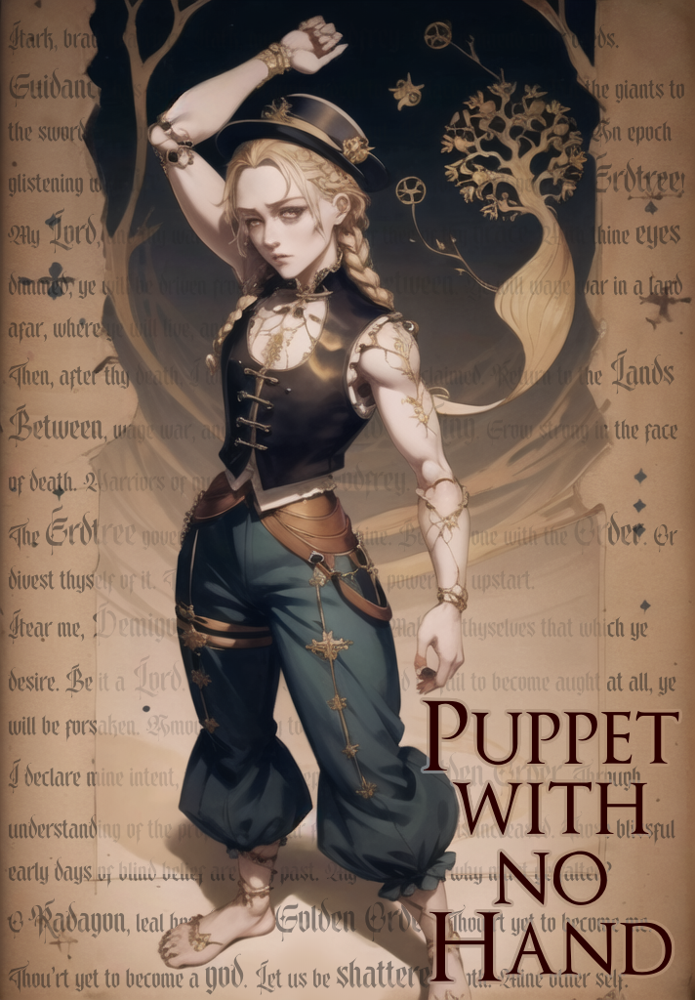

# Puppet with no Hand

_Across the Lands Between, the demigods find themselves strangely nostalgic. At the same time, one of Seluvis' dolls begins to move on its own..._

An Elden Ring fanfic based on an alternate main scenario. The structure forgoes traditional glue scenes. Instead, the narrative moves forward to the next major event (boss fight) in each even-numbered chapter. Each odd-numbered chapter is a vignette about the circumstances leading to the boss becoming who and what they are.

## Chapters

1. [Blaidd](./01-blaidd.md)
2. [Shadow of the Princess](./02-shadow-of-the-princess.md)
3. [Rennala](./03-rennala.md)
4. [Queen of the Benighted Tree](./04-queen-of-the-benighted-tree.md)
5. [Godrick](./05-godrick.md)
6. [Effigy of the Golden Lineage](./06-effigy-of-the-golden-lineage.md)
7. [Radahn](./07-radahn.md)
8. [Conqueror of Fate](./08-conqueror-of-fate.md)
9. [Gurranq](./09-gurranq.md)
10. [Shadow of the Queen](./10-shadow-of-the-queen.md)

## Design docs

- [Objectives and design](./outline.md)
- [Notes on possible Wuxing relationship of magic schools](./wuxing.md)